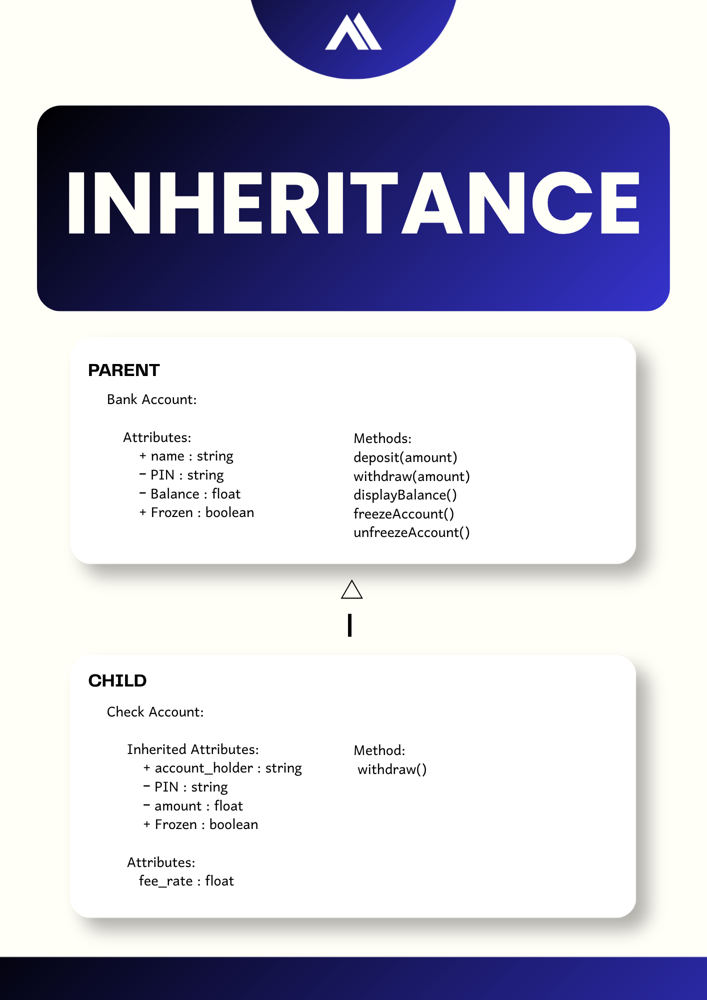
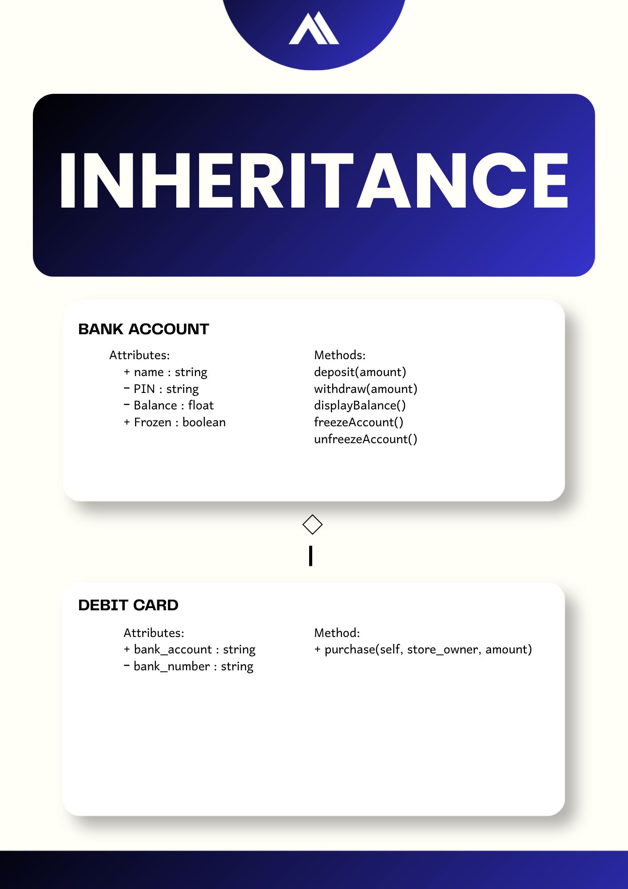
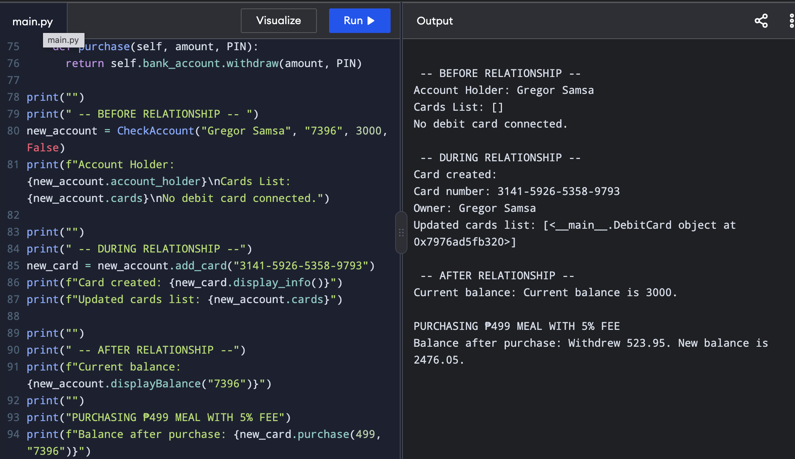
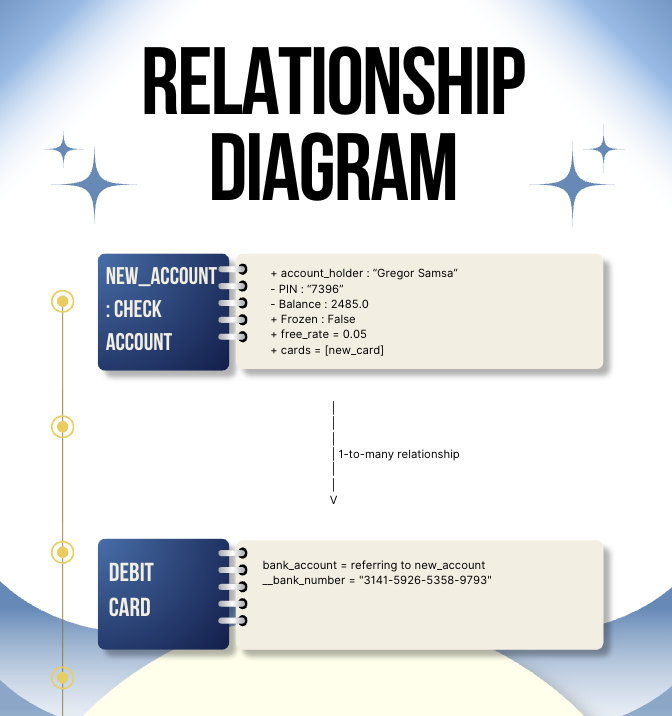

# Advanced Class Relationships
## Previous Activities
[Class Attributes](classAttributesMethods.md)
[Class Relationships](classRelationships.md)
## Existing System Description:
  1. What classes currently exist in your system?
     - Class 1: Bank Account
     - Class 2: Debit Card
  2. My current design has a repeated structure and the relationship between the two classes is weak.
## Inheritance Relationship
Parent: Bank Account
Child: Check Account
Explanation: A check account is a specific form of bank accounts which allows users to deposit, withdraw, and pay for daily expenses through debit cards or checks.
## Inheritance UML

## Composition/Aggregation
Relationship: Aggregation
Explanation: A debit card has its different systems than a bank account.
## Advanced UML Diagram

## Python Implementation
[Source Code](advancedRelationships.py)
## Test Run

## Object Diagram

## Reflection
Answers:
### 1. Why did you choose your inheritance relationship? Explain why your child class is a type of your
parent class.
I chose my inheritance relationship to be aggregation. This is because a debit card has a "HAS-A" relationship with a bank account in which Debit Card HAS-A Bank Account. Another reason why I chose aggregation was that although a debit card does have a bank account, they still have their own individual systems.
### 2. How did inheritance reduce duplicate code? Identify attributes or methods that were reused.
Through inheritance, attributes and methods didn't require to be copy and pasted over and over again. Instead of repeatedly typing the same attributes and methods, I only needed to type them once in the parent class (Bank Account) and use super() in the rest of the code of the child class. The attributes I had reused from class BankAccount to class CheckAccount were account_holder, PIN, balance, and frozen and the method I reused from the parent class BankAccount was withdraw.
### 3. Why is your HAS-A relationship Composition or Aggregation? Explain the lifecycle relationship
between the two objects.
In real life, a bank account can still exist without a debit card and vice versa. When a debit card is broken, the bank account's system is still intact and isn't broken along with the debit card. This is why in the code, the BankAccount class is a whole separate system that can work on its own even without the DebitCard class.
### 4. What is the difference between Association from Part III and the advanced relationship you
implemented?
In Part III, I had already made an Aggregation relationship between the BankAccount class and the DebitCard class. I did this by adding self.bank_account = bank_account in the DebitCard class. What this line did is that it formed a connection between the two, creating a "HAS-A" relationship wherein DebitCard HAS A BankAccount because of that line being in DebitCard which meant that a DebitCard does have a BankAccount.
### 5. How does your design follow the DRY principle?
My program follows the DRY principle as it doesn't repeat shared attributes and simply uses relationships to link two classes together. In DebitCard class, shared attributes such as account_holder aren't duplicated and instead just uses super() to inherit attributes. The same method can be used for methods which I've done for withdraw where instead of typing the code again, I simply used super().withdraw() to avoid repetition.
