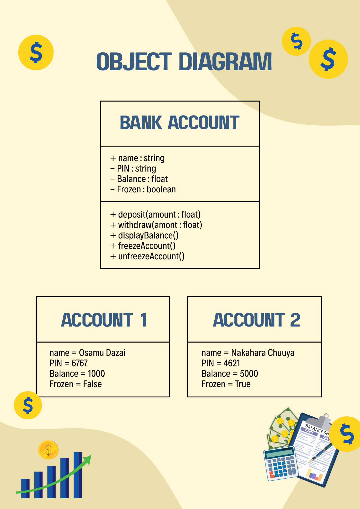

# Class Attributes and Methods
## Previous Design
Link to my previous activity:
[classObjectUML.md](q1/classObjectUML.md)
## Design Revision
Describe any changes made to your original class.
## Visibility Decisions
| Attribute | Data Type | Visibility | Reason |
|---|---|---|---|
| Account Holder | string | Public | The account holder name doesn't require as much protection and can be easily changed. |
| PIN | string | Private | The PIN must be protected and kept private to ensure that outside code won't directly change the PIN. |
| Balance | float | Private | The account's balance must be private so that outside input wouldn't easily change the balance and cause issues. |
| Frozen | Boolean | Public | The bank account's status must be public because the purpose of frozen status is to be accessible without a PIN in case suspicious activity needs the account to be frozen. |
## Updated UML Class Diagram

## Python Implementation

[View Python Source](q1/classImplementation.py)
## Test Run

## Object Diagram

## Analysis
### Why did you make your chosen attribute private?
I chose PIN to be private so that the PIN of the bank account won't be easily changed and compromised. Meanwhile, I made balance private so that it won't be easily altered by cybercriminals.

### Which method changes the state of your object?
deposit(), withdraw(), freezeAccount(), and unfreezeAccount() changes the state of my object because deposit() increases the value of the amount, withdraw() decreases the value of the amount, freezeAccount() changes the status of the object to True, and unfreezeAccount() changes the status of the object to False.

### How did your two objects demonstrate that instances are independent?
The two objects showed that the instances are independent because when I performed the methods on both the accounts, the methods I performed were only acted upon their respective account.

### What is the difference between your class diagram and your object diagram?
In my class diagram, it only shows the diagram of the class BankAccount and its attributes while my object diagram shows not only the class BankAccount and its attributes but also the attributes of the two objects I used to run the program.