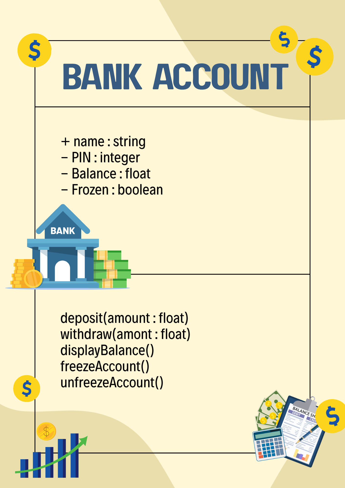

# SG4 - Understanding Classes and Objects
## Store
## A store is where people buy products provided by the store owner.
## Properties
| Property | Data Type | Description |
|---|---|---|
| Name of Store | string | Name of the store |
| Name of Store Owner | string | Name of the store's owner |
| Type of Store | string | Indicates the common theme of the store |
| Available Products | int | Shows how many products are available |
| Availability | boolean | Indicates the store's availability |
## Methods
| Method | Description |
|---|---|
| addProducts() | Adds products into the program |
| removeProducts() | Removes products out of the program |
| editProduct(productname : string, price : float) | Edits product information |
| displayProduct() | Displays the product/s available |

## Class Diagram

## Design Explanation
### Why did you choose this class?
I chose this class because stores are one of the important parts of economy.
### Which property is the most important? Why?
The availability because it asks if the store is available in the first place. If the store isn't available then the other methods are unusable.
### Which method is the most useful? Why?
In my opinion, the most useful method among the three I listen down is displayProduct(). Without this method, the user is unable to know the products available before even considering to add or remove one.