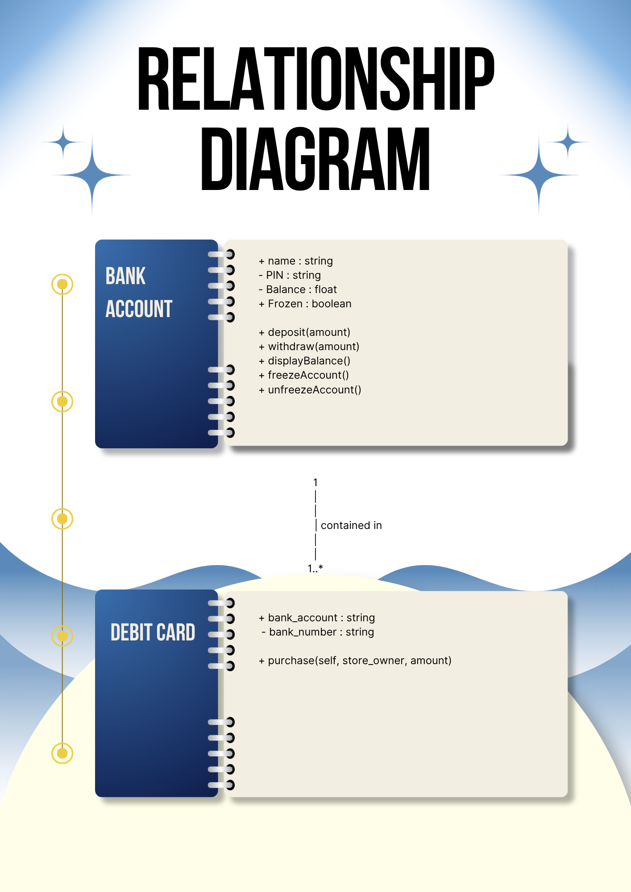
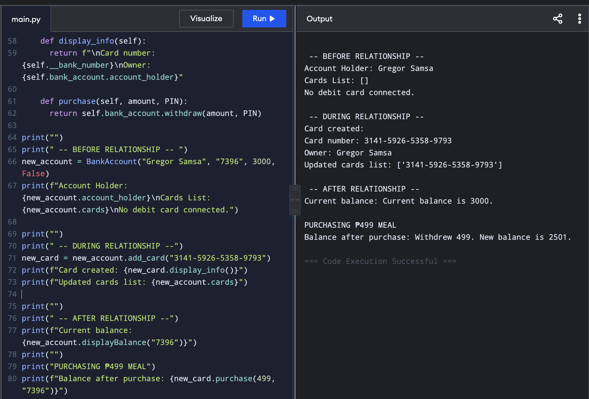

# Class Relationships: Association and Multiplicity
## Previous Work
[Part I - Classes and Objects](classObjectUML.md)
[Part II - Class Attributes and Methods](classAttributesMethods.md)
## Existing Class
Class: Bank Account
Description: A bank account allows users to store their money virtually and gives users the ability to pay within a tap of a finger.
## New Related Class
Class: Debit Card
Description: A debit card allows users to purchase items through a bank account.
## Association
Relationship: A debit card contains a bank account.
Explanation: A bank account with a balance is needed in order to purchase with the debit card.
## Multiplicity
Multiplicity: One to many
Explanation: A joint account uses separate debit cards per holder but creates purchases through the same account.

## UML Class Relationship Diagram

## Python Implementation
[View Python Source](classRelationships.py)
## Test Run

## Object Relationship Diagram

## Analysis
### What is the association between your two classes?
### What multiplicity did you choose and why?
### How did you implement the relationship in Python?
### Why did you store an object reference instead of copying its data?
### If your relationship uses many, why is a list appropriate?
